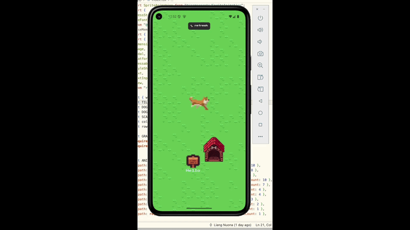
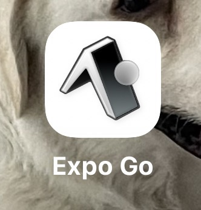
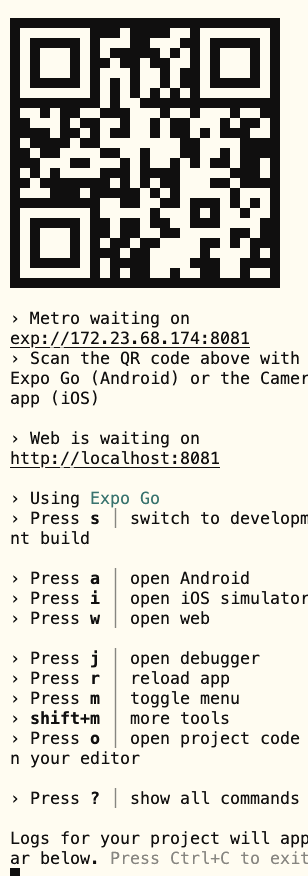

# Tech Tutorial: React Native 
This tutorial introduces **React Native** ,a framework for building real
native mobile apps using JavaScript and React. 
Instead of starting from scratch, this tutorial focuses on what's **the same** and what's
**different** compared to the web React you already know.


The demo consists of two side-by-side projects:
- `dog_web/` — React + Node.js (TypeScript) — Web version, the baseline you already know
- `dog_app/` — React Native + Expo (TypeScript) — Native version, the tutorial focus 


Both apps implement the same dog scene, so you can compare them line by line. 


## 🐶🪵Demo GIF
  

## ❓What is React Native?

React Native is a framework that lets you build **real native mobile apps** using JavaScript and React — the same language and component model you already use on the web.

Unlike a website opened in a mobile browser, React Native apps compile to **actual native UI components** (not HTML). A `<View>` becomes a native `UIView` on iOS and an `android.view.View` on Android — giving you the performance and feel of a real app.

The key insight: **you already know most of it.** The same `useState`, `useEffect`, `props`, and component patterns work exactly as they do in web React. You are mainly learning a new set of UI primitives — different building blocks for screen, touch, and layout.


## ❓What is Expo?

Expo is a **toolchain and set of libraries built on top of React Native** — think of it as the npm + Express of the React Native world: it handles setup, dev server, and packages so you can focus on writing code.

**🔑Key Expo Tools**
| Tool | Role |
|------|------|
| **Expo CLI** (`npx expo start`) | Starts the dev server, like `npm run dev` |
| **Expo Go** (phone app) | Scans the QR code and runs your app instantly — no build step |
| **expo-router** | File-based routing (like Next.js), `app/index.tsx` = home screen |
| **expo-font** | Loads custom fonts asynchronously |

<br/>


## 👌Read This Tutorial

1. **Run the web version first** (`dog_web/`) — it's plain React you already know
2. **Run the React Native version** (`dog_app/`) — see the same app on your phone
3. **Read the Code Comparison section** — find the exact lines that changed
4. **Open both `dog_web/src/App.tsx` and `dog_app/app/index.tsx` side by side** — they implement the same features, so you can trace each interaction from web to native directly

> Both projects implement identical features. When you see something unfamiliar in `index.tsx`, the same thing in `App.tsx` shows you the web equivalent.


## 🤓What the Demo Does
Both `dog_web` and `dog_app` implement the same interactive dog scene. Here's what you can do and which concepts are behind each interaction:

| Interaction | What happens | Concept used |
|-------------|-------------|--------------|
| Tap **🦴 refresh** | Repositions the dog and plays a random animation | `Pressable` + `onPress` — React Native |
| Tap the **dog house** | Toggles a color change on the house | `useState` — React / `Image` sprite offset — React Native |
| Tap the **sign board** | Opens a message input overlay | `Modal` + `TextInput` — React Native |
| Tap the **dog** | Triggers a run animation and dialog bubble for 3 seconds | `useState` + `setTimeout` — React |
| App loads | Grass tiles fill the screen without flickering on re-renders | `useMemo` — React |


## ⚒️Prerequisites 
👇 Before start, please make sure you have already installed the following tools:


| Tool | Minimum Version | Purpose | Install |
|------|----------------|---------|---------|
| Node.js | 18.0+ | Run JavaScript and npm | [nodejs.org](https://nodejs.org) |
| npm | 9.0+ | Install packages | Comes with Node.js |
| **Expo Go** (phone) | Latest | Preview app on your phone | [expo.dev/go](https://expo.dev/go) |
| Android Studio *(optional)* | Latest | Android emulator | [developer.android.com/studio](https://developer.android.com/studio) |

> **Expo Go** is recommended🤓 on your phone (iOS or Android) to preview the React Native app. Install it from the App Store or Google Play before starting.
>
**_Screenshot：_**  

> **Android Studio** is optional — only needed if you want to use an Android emulator instead of your phone. After installing: open Android Studio → Virtual Device Manager → create a device → start it.


<br/>


## Getting Started🤓
### Step 1: Clone the Repository

```bash
git clone https://github.com/UOA-CS732-S1-2026/cs732-tech-tutorial-lnuo026.git
cd React_Native
```

### Step 2: Run the 🖥️Web Version(`dog_web`)

```bash 
cd dog_web                           
npm install
npm run dev                     
```    
Then open the URL shown in your terminal (e.g. http://localhost:5173)    
- this is the baseline. Every feature you see here exists identically in the React Native version.

### Step 3: Run the 📱 **React Native** version (`dog_app`)
Open a **new terminal** (keep the web version running if you want to compare side by side):

```bash
cd dog_app
npm install
npx expo start
```

A QR code appears in the terminal. Choose how to run the app:

**_Screenshot：_**  
 

| Option | How | When to use |
|--------|-----|-------------|
| **Scan QR code** (recommended😤) | Open camera (iOS) or Expo Go app (Android) and scan | Real device, fastest |
| Press `w` | Opens in browser | Quick check, no phone needed |
| Press `a` | Opens Android emulator | Requires Android Studio setup |

> **iPhone users:** point your default camera app at the QR code — it launches automatically in Expo Go.
>
> **Android users:** open the Expo Go app first, then tap "Scan QR code".


## 📂Project Structure
```
React_Native/
├── dog_web/                          # Web version (React + Node.js)
│   └── src/
│       ├── App.tsx                   # Main component — all UI and logic
│       ├── SpriteAnimation.tsx       # Sprite sheet animation (web version)
│       └── index.css                 # Global styles (React Native has no .css files)
│
├── dog_app/                          # React Native version (Expo)
│   ├── app/
│   │   ├── _layout.tsx               # App shell — sets up navigation, hides header
│   │   └── index.tsx                 # Home screen — all UI and logic (mirrors App.tsx)
│   ├── components/
│   │   └── SpriteAnimation.tsx       # Same component, React Native implementation
│   └── assets/                       # Dog sprites, grass tiles, house, sign images
│
└── screenshots/                      # App screenshots and demo
```

**Key mapping:** `dog_web/src/App.tsx` ↔ `dog_app/app/index.tsx` — these two files implement the same features. When you see something unfamiliar in `index.tsx`, find the same interaction in `App.tsx` to see the web equivalent.

## 🗝️ Key Concepts

### What's the **same** in React and React Native  

- `import` / `export` — Identical ES module syntax
- JSX syntax — Components look the same
- `useState` / `useEffect` / `useMemo` — Same hooks, same API
- Props & Components — Same pattern
- TypeScript — `{ name: string }` works the same
- All JS logic — Loops, conditions, functions, no difference 


### What's **different**
- `<div>` → `<View>`
- `<p>`, `<span>` → `<Text>`
- `` → `<Image source={require('...')}>`
- `<input>` → `<TextInput>`
- `<button>` + `onClick` → `<Pressable>` + `onPress`
- `{show && <div>}` → `<Modal visible={show}>`
- `fontSize: '16px'` → `fontSize: 16` (no px)
- `@import url(...)` in CSS → `useFonts()` async hook
- External `.css` file → `StyleSheet.create()`  

## Code Comparison: 🖥️Web React vs 📱React Native   

### 1. Container element
**Web React**
```tsx
<div style={{ width: '100vw', height: '100vh' }}>
...
</div>
```                                                                           
**React Native**
```tsx
<View style={{ flex: 1 }}>
...
</View>
```
> `div` becomes `View`. Note: no `px` — React Native uses unitless numbers.   

---

### 2. Image

**Web React**
```tsx          
 
```

**React Native**
```tsx
<Image
source={require('@/assets/dog/Akita-Idle.png')}
style={{ width: 100, height: 100 }}
/>
``` 

> Two differences: attribute name changes from `src` to `source`, and you use
`require()` instead of a string path. This is because React Native needs to   
bundle the file at compile time.

--- 

### 3. Click / Press

**Web React**
```tsx
<button onClick={handleRefresh}>
🦴 refresh
</button>

<div onClick={() => setShowInput(true)}> 
...
</div> 
```             

**React Native**
```tsx
<Pressable
onPress={handleRefresh}
style={({ pressed }) => [styles.refreshBtn, pressed && { opacity: 0.5 }]}
> 
<Text>🦴 refresh</Text>
</Pressable>

<Pressable onPress={() => setShowInput(true)}> 
...
</Pressable> 
```
> On web, any element can take `onClick`. In React Native, you must wrap with
`Pressable` — and it gives you a `pressed` state for visual feedback. 

---  

### 4. Modal / Overlay   

**Web React**
```tsx
{showInput && (
<div onClick={() => setShowInput(false)} style={{
position: 'fixed', inset: 0, 
backgroundColor: 'rgba(0,0,0,0.5)',
display: 'flex', alignItems: 'center', justifyContent: 'center',        
zIndex: 100,
}}>  
...  
</div>  
)}    
```

**React Native**   
```tsx
<Modal visible={showInput} transparent animationType="fade">                  
<Pressable style={styles.modalOverlay} onPress={() => setShowInput(false)}>
...  
</Pressable> 
</Modal>
```                                                                           
> On web, you manually build an overlay with `position: fixed`. React Native
has a built-in `<Modal>` component — one tag handles it all.                  

---

### 5. Text Input 

**Web React**
```tsx
<input
value={inputText}
onChange={(e) => setInputText(e.target.value)}
placeholder="type here..."
/>    
```

**React Native**
```tsx  
<TextInput
value={inputText}
onChangeText={setInputText}
placeholder="leave a message for Hammer..."
/>  
```
> `onChange` becomes `onChangeText` — and it passes the string directly, no   
`e.target.value` needed. 

---  

### 6. Fonts   

**Web React**        
```css  
/* index.css */     
@import
url('https://fonts.googleapis.com/css2?family=Press+Start+2P&display=swap');  
```

**React Native**
```tsx 
// install: @expo-google-fonts/press-start-2p
import { PressStart2P_400Regular, useFonts } from   
'@expo-google-fonts/press-start-2p';

const [fontsLoaded] = useFonts({ PressStart2P_400Regular });

const pixelFont = fontsLoaded ? { fontFamily: 'PressStart2P_400Regular' } :   
{};     
``` 
> On web, one CSS import line is enough. In React Native, fonts load
**asynchronously** — you use the `useFonts()` hook and wait for it to finish  
before applying the font family.

---

### 7. Screen Dimensions

**Web React**
```tsx
const dogX = Math.random() * (window.innerWidth - 400);
const dogY = Math.random() * (window.innerHeight * 0.4);
```

**React Native**
```tsx
import { Dimensions } from 'react-native';

const { width, height } = Dimensions.get('screen');
const dogX = Math.random() * (width - DOG_WIDTH * SCALE);
const dogY = Math.random() * (height * 0.4);
```

> React Native has no `window` object. `Dimensions.get('screen')` is the equivalent — it returns the physical screen size in density-independent pixels.

---

### 8. Stylesheet

**Web React**
```css
/* index.css */
.refresh-btn {
  background-color: #333;
  border-radius: 8px;
  padding: 10px 16px;
}
```

**React Native**
```tsx
const styles = StyleSheet.create({
  refreshBtn: {
    backgroundColor: '#333',
    borderRadius: 8,
    padding: 10,
  },
});
```

> React Native has no CSS engine. Styles are plain JavaScript objects grouped with `StyleSheet.create()`. No class names, no selectors, no cascading — styles are applied directly to components via the `style` prop. Note: no `px`, no `rem`, no `%` for most properties.

---
## 😟Troubleshooting

| Problem | Solution |
|---------|----------|
| Expo Go can't find the QR code | Make sure your phone and computer are on the **same WiFi network** |
| Metro bundler stuck at "Loading" | Press `r` in the terminal to reload, or restart with `npx expo start --clear` |
| Android emulator not showing up | Make sure a device is started in Android Studio → Virtual Device Manager. If not installed, see [Prerequisites](#prerequisites) |
